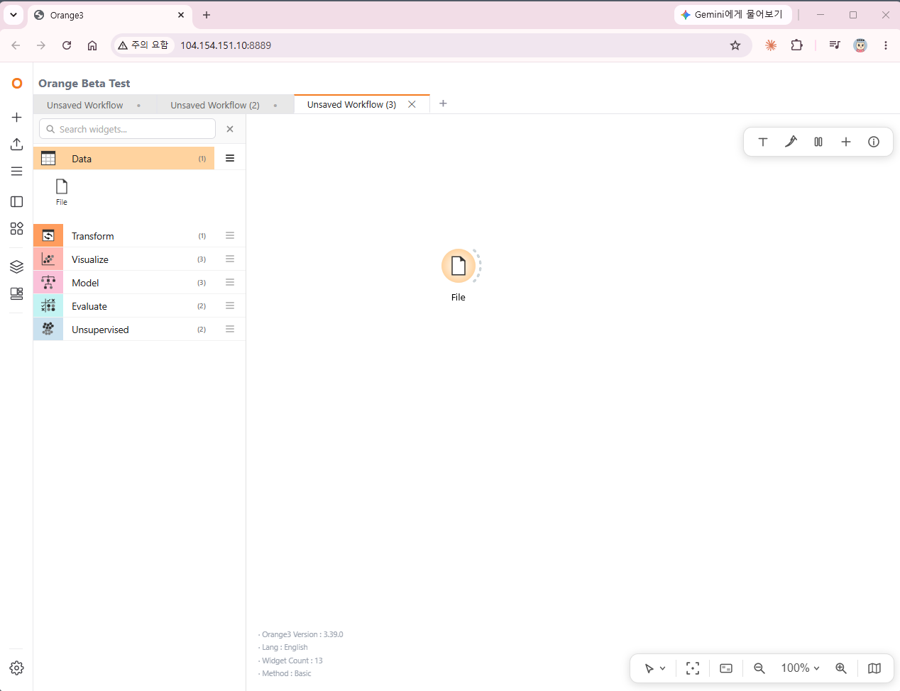

## 2026년 오픈소스 제출

-AI 데이터 분석 오렌지 3의 웹 기반을 파일럿으로 적용하였습니다.
-유사 사례 VNC 적용 사용 불편 및 가상 머신으로 이용자 불편 발생
-오픈소스 웹 기반을 적용하였으며, 내부 테스트 검증 용 진행

[참조]
-오렌지 3 : https://orangedatamining.com/
-깃허브 : https://github.com/biolab/orange3

-사용자 편의성과 웹 전환의 목표 진행
-적용시 많은 오류에 직면, 많은 수정 진행
-개선 버전 URL을 통해, PC 버전과 비교 사용 가능
-접속 경로 : http://59.7.109.17:8889/
-테스트 일부 위젯 반영

## orange3web
-피시 설치형 데이터 분석 프로그램 Orange3 웹 프로그램 파일럿 제작
-AI 웹 기본 구조 작업, 위젯과 데이터 분석 로직 부분 추가 확장 연속 진행 필요
- 파일썬 GUI 프로그램 AI 분석 프로그램 개선 오픈소스 프로젝트 

- Orange3 웹 배포
— Docker 기반 한국어 Orange3 GUI를 브라우저에서 다중 세션 제공
- 세센 분리가 안되는 부분
- 화면 리플래쉬가 동작 오류를 개선
- 각 사용자에게 격리된 Orange3 컨테이너 동적 할당
- 초기 세팅 과정 나오지 않는 부분 개발 과정 다른 이슈, 계속 보완
- 화면 noVNC(WebSocket RFB)로 브라우저에 전송
- 세션 매니저가 워밍풀·라우팅·언어 전환·워크플로우 업로드 등 담당
- 파일럿 버전 제작
 

## 접속 페이지
http://59.7.109.17:8889/

## 스크린샷


## 라이선스 / 출처
Orange3(GPLv3) 알고리즘 라이브러리를 재사용합니다. 배포 시 해당 라이선스를 준수하세요.

## 개발 사용
1. 로컬 PC  및 배포용   DOCKER 설치
2. NODE.JS
3. python 12 버전 분석(소스 분석 및 API 연동)
4. VS CODE 사용(깃허브 배포용 마지막 사용)

## 구성

| 구성 요소 | 설명 |
|-----------|------|
| `session_manager/` | FastAPI 세션 매니저 — 컨테이너 spawn·워밍풀·래퍼 페이지(WRAPPER_PAGE)·API |
| `Dockerfile` | Orange3 GUI 컨테이너 이미지 (noVNC + Xvnc + openbox + Orange3) |
| `Dockerfile.webserver` | 웹 API 서버 이미지 |
| `Dockerfile.xpra` | Xpra 전송 실험 이미지 (PoC) |
| `docker-compose.yml` | 세션 매니저 · 웹 서버 · 이미지 빌드 타깃 |
| `docker-compose.nginx.yml` | Nginx 정적 오프로드 오버레이 (opt-in) |
| `orange3_launcher.py` | 컨테이너 내 Orange3 기동 + IPC(위젯 추가·삭제·언어 등) |
| `widgets_override/` | 기능 커스터마이징된 위젯 오버라이드 |
| `html/` | 래퍼 UI·모달·데이터셋 페이지 |
| `nginx/` | Nginx 리버스 프록시 + 정적 alias 설정 |
| `startapp.sh` / `startapp.xpra.sh` | 컨테이너 기동 스크립트 |


## 설정

```bash
cp .env.example .env   # HOST_BASE, Google OAuth 값 입력 (.env 는 커밋 금지)
```


## 클론 후 셋업 체크리스트 (필수)

GitHub 클론만으로는 **소스 코드는 모두 받아지지만, 일부 런타임 콘텐츠·환경설정은
`.gitignore` 로 제외**되어 있어 그대로 실행하면 File 위젯의 데이터셋 연결 등이 동작하지
않는다(데이터셋 카탈로그가 비고, 파일 탐색기가 `/data` 를 찾지 못함). 아래를 반드시 수행한다.

1. **`.env` 생성** — `cp .env.example .env` 후 `HOST_BASE` 를 이 머신의 실제 경로로 수정
   (드라이브 문자 소문자 + 앞에 `/`. 예: `e:\proj` → `/e/proj`). 이 값이 `data/` 등의
   bind-mount 경로(`HOST_DATA_PATH`)를 결정한다. 비면 `/data` 가 마운트되지 않는다.
2. **데이터셋(`data/`)** — 기본 예제 데이터셋(Classification·Clustering·Regression·Text,
   약 52MB)은 리포에 **포함되어 있다**(클론하면 바로 사용 가능). 추가 데이터셋을 넣으려면
   해당 카테고리 폴더에 `.tab` 파일을 두고 `git add -f data/<카테고리>/<파일>.tab` 로 추적에
   추가한다(`.gitignore` 가 `data/` 를 기본 제외하므로 `-f` 필요). `.tab` 은
   `.gitattributes` 가 LF 로 고정한다(CRLF 시 컨테이너 파싱 깨짐).
3. **교재 워크플로우(`_upload_ows_/`)** — 기본 제외하되 `orange3_book/`(교재 BOOK 워크플로우,
   ~154MB)은 리포에 **포함**되어 클론하면 바로 사용 가능. 그 외 `_upload_ows_/` 대용량 콘텐츠를
   추가하려면 별도 배포본을 해당 경로에 푼다.
4. **이미지 빌드** — `owfile.py` 등 커스텀이 GUI 이미지에 반영되려면 클론 후 반드시 재빌드:
   `docker compose --profile build-only build orange3-gui`.

> 요약: **빠지는 건 소스가 아니라 `data/` 외 런타임 콘텐츠와 `.env`(경로/시크릿 환경변수).**
> 위 4단계를 마치면 File 위젯 데이터셋 연결·파일 탐색이 로컬과 동일하게 동작한다.


## 배포 / 실행 (Docker)

이 프로젝트는 **Docker 기반 배포만** 사용한다(서버리스/Vercel 미사용 — `vercel.json` 에서
git 배포 비활성). 멀티 컨테이너(세션 매니저 + 동적 GUI 컨테이너 + 웹 서버)라 Docker
호스트가 필요하다.

```bash
docker compose -f docker-compose.yml --profile build-only build   # 이미지 빌드
docker compose up -d                                              # 세션 매니저·웹 서버 기동
# 세션 매니저: http://localhost:8888
```

> **빌드 의존성**: Orange3 본체는 빌드 시 `pip` 로 설치되고, 한국어 번역/오버라이드
> 파일(`orange3/` 하위 21개)은 저장소에 포함되어 있어 **클린 클론만으로 빌드된다**.
> (`orange3/` 벤더 트리 전체는 `.gitignore` 로 제외 — 빌드엔 불필요.)


### 외부 배포 (Google Compute Engine)

GCE 리눅스 VM 으로 외부 공개하려면 [`deploy/gce/README.md`](deploy/gce/README.md) 참고
(VM 생성 · 방화벽 · `setup_gce.sh` 부트스트랩 · 빌드/기동 절차).


## 참고

- 화면 전송은 noVNC WebSocket RFB (스크린샷 폴링 아님)
- 런타임 데이터(`sessions/`, `config/`)·대용량 교재 콘텐츠(`_upload_ows_/`)는 리포에서 제외
- - 기본 예제 데이터셋(`data/`, ~52MB)은 `git add -f` 로 추적에 포함 — 클론 즉시 사용 가능

## 개선과제
- 사용자 증가시 메모리 증가 : 서버 최적화 진행, 오렌지 3 캔버스 상속으로 사용자 증가에 따른 메모리 증가 발생
- 위와 동일한 원인 서버 콘테이너 증가 로  서버 부하 발생, 100명 미만의 접속에서는 용이함 [대용량 시스템에서는 개선 필요]
- 언어 변경 시간 지연 발생

  ## 개선과제
- 오픈소스 새로운 버전의 개선 작업 중임
- 버전 업 중임[26.7]

- 
